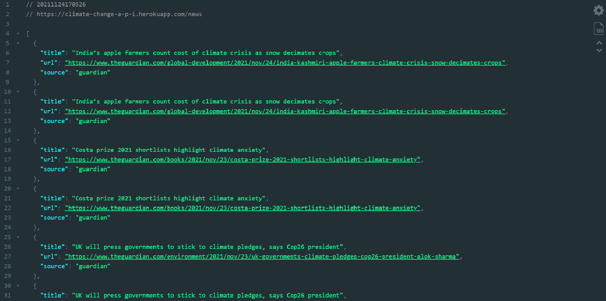
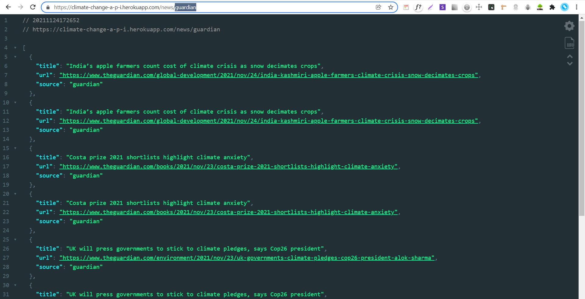

# Climate-Change-API
Node.js ,Express.js ,Nodemon ,Cheerio ,Axios.

###Links

`ALL news regarding climate change from all the sources` : <https://climate-change-a-p-i.herokuapp.com/news>

`Specific Site for news regarding climate change` : <https://climate-change-a-p-i.herokuapp.com/:Name>

* Site Names: cityam,thetimes,guardian,telegraph,nyt,latimes,smh,un,bbc,es,sun,dm,nyp.

###Images

Image:

> climate-change-a-p-i.herokuapp.com/news

> climate-change-a-p-i.herokuapp.com/news/:Name-Guardian
 

